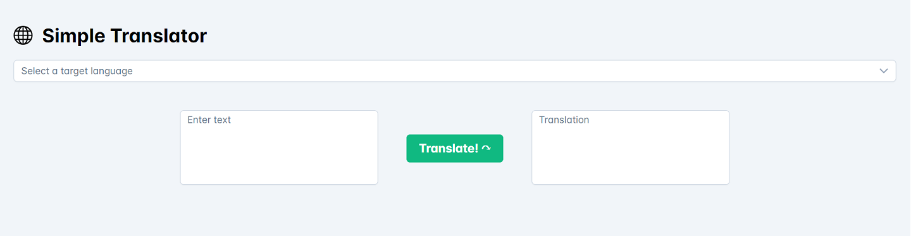

# Simple Translator App

This project is a simple translator web application developed as part of the Cloud Computing II course at DHBW Stuttgart. Written in JavaScript and utilizing Google Cloud Translation AI, the app enables users to translate text between languages. It's designed for cloud deployment and comes with Terraform and Ansible scripts for easy setup. Additionally, it leverages Redis to store previous translation requests, enhancing efficiency. The goal is to showcase practical implementation of cloud computing concepts in a real-world application.

# Deployment (Local)

1. If not already done, install [Docker Compose](https://docs.docker.com/compose/install/) and [gcloud cli](https://cloud.google.com/sdk/docs/install).
2. Run `gcloud auth application-default login` and follow the instructions to setup up the application default credentials.
3. Run `docker compose up` to start the project.
4. Open http://localhost in your favorite web browser.

# Deployment (Cloud)
ToDo finalize:

1. Make sure git, terraform and ansible is installed on the host machine
2. On your Google account activate Cloud Resource Manager API
3. Activate Google Cloud Translation API like here https://cloud.google.com/translate/docs/setup
4. IAM & Admin -> Service Accounts -> Compute Engine default service account -> Manage Keys - Creste New Key (JSON)
5. On Host machine
6. git clone https://github.com/J-C-V/dhbw-cc-translate.git
7. cd dhbw-cc-translate/deployment/terraform
8. main.tf anpassen - PROJECT_ID, SSH_KEY, EMAIL_OF_SERVICE_ACCOUNT
9. terraform init
10. terraform apply -auto-approve
11. Take note of output display VM_IP and REDIS_IP - We need it for ansible
12. Make sure gcp-vm1 can reach gcp-vm2 per ssh
13. cd ../ansible
14. playbook.yml anpassen BACKEND_URL (http://VM_IP:8080), REDIS_HOST
15. inventory.ini anpassen - VM_IP, USER
16. create file gcp_credentials.json mit dem vorher erstellen Service account key
17. ansible-playbook -i inventory.ini playbook.yml
18. Firewall -> VPC-Network -> Firewall -> CREATE FIREWALL RULE -> ALL INSTANCES ON THE NETWORK -> Source: 0.0.0.0/0, Ports: tcp:80, 8080
19. Client accessible under http://VM_IP and translation service under http://VM_IP:8080

# Docs

ToDo
